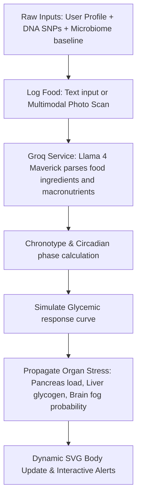

# 🧬 VitoSynth AI — The Metabolic Digital Twin

> **"Stop guessing. Start simulating."** VitoSynth AI is a state-of-the-art, client-side biological forecasting system that maps nutrition, DNA SNPs, microbiome trends, and chronotypes to a real-time digital twin.

🚀 **Live App:** [vitosynth.vercel.app](https://vitosynth.vercel.app)  
⚡ **API Partner:** [Groq Cloud (Llama 4 Maverick Multimodal)](https://console.groq.com)

---

## ⚡ The Quick Tour 

Most health trackers look backward (logging what you already ate). **VitoSynth AI looks forward.** 

By modeling user metrics, circadian rhythms, microbiome state, and raw genomic DNA files (23andMe), VitoSynth runs **predictive biological simulations** using Groq's ultra-low-latency Llama-4 Maverick engine. It projects:
- **8-Hour Glycemic Curve** (Glucose & Insulin curves via Recharts)
- **Anatomical Organ Stress** (Brain, Heart, Liver, Stomach, Adrenals)
- **Mental Performance & Brain Fog Risks** (Hour-by-hour cognitive forecast)
- **Circadian Melatonin/Cortisol Alignment** (Optimal feeding/fasting windows)

---

## 🎨 Interactive App Modules

VitoSynth features 10 fully-integrated panels wrapped in a premium, dark-mode glassmorphic interface:

| Module | Core Functionality | Biological Insight |
| :--- | :--- | :--- |
| **🫁 Anatomical Organ Visualizer** | Interactive vector body overlay. | Real-time visual stress highlights (SVG Glows & dynamic stomach bacteria swarm particles). |
| **🧪 Metabolic Timeline Forecast** | Live glucose/insulin simulation chart. | 3-Hour spike warnings & metabolic burn vs. storage tracking. |
| **⏱️ Fasting & Autophagy Tracker** | 5-stage intermittent fasting model. | Maps metabolic zones (Anabolic, Catabolic, Ketosis) and active autophagy/glycogen metrics. |
| **🧠 Cognitive Performance Panel** | Area chart of cognitive clarity indices. | Brain fog probability indicators, neurotransmitter balance models. |
| **🧬 Pharmacogenomic DNA Parser** | Raw DNA file SNP interpreter (MTHFR, APOE). | Custom obesity risk mapping & saturated fat/caffeine sensitivity profiles. |
| **⏰ Circadian Chronobiology Clock** | Chronotype tracker (Lark, Owl, Intermediate). | Recommends optimal timezone feeding & melatonin suppression warnings. |
| **🍳 Multimodal Smart Chef** | Fridge scanner via text input or device camera. | Groq-analyzed recipes matching genetic & diabetic restrictions. |
| **📅 AI Weekly Meal Planner** | Chronobiology-guided 7-day meal plan. | Instant log-to-dashboard system with automated macro distributions. |
| **📊 Food Log & Inflammatory Reports** | Log history filter + search. | Aggregated AI-generated inflammatory loads, safety markers, and allergen flags. |
| **💬 Live AI Health Coach** | Contextual chatbot panel. | Real-time chat guidance powered by user biometrics & meal history. |

---

## 🛠️ The Technical Stack

- **Framework:** React 19 + TypeScript 5.8 (Strict Typing)
- **Build System:** Vite 6 (Zero-lag hot reloads + custom Rollup code-splitting chunks)
- **Inference Engine:** `groq-sdk` (Llama-4-Maverick-17B Multimodal & Llama-3.3-70B-Versatile)
- **Charting & Visuals:** Recharts SVG engine + Framer Motion micro-animations
- **Styles:** Custom glassmorphism utilities, neon CSS themes (`#00F5E1`, `#A78BFA`), and Lucide icons

---

## 🧬 Scientific Forecasting Pipeline

VitoSynth calculates predictions using a multi-layered diagnostic pipeline:



---

## ⚡ Setup in 3 Steps (Local Dev)

```bash
# 1. Clone & Install dependencies
git clone https://github.com/theShivansh/VitoSynth.git
cd VitoSynth
npm install

# 2. Add your Groq API Key
echo "VITE_GROQ_API_KEY=gsk_your_key_here" > .env.local

# 3. Spin up local server
npm run dev
```

Ready for **instant deployment** on Vercel with zero server-side configurations needed!
